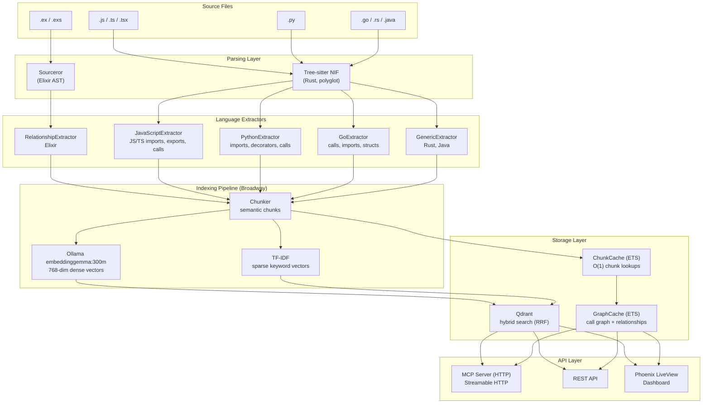
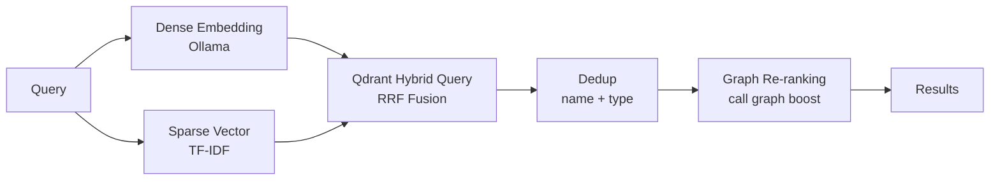
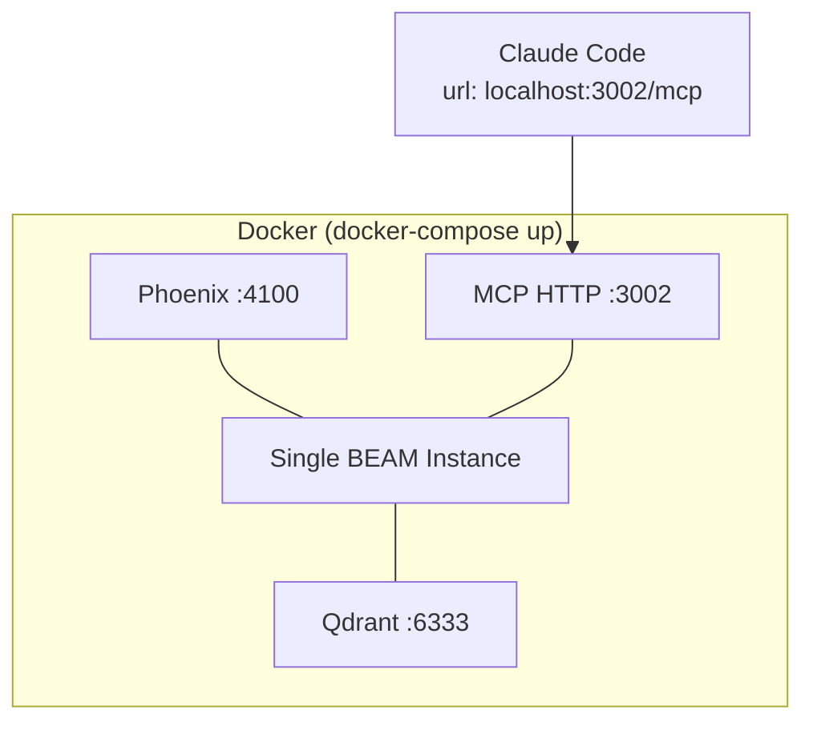
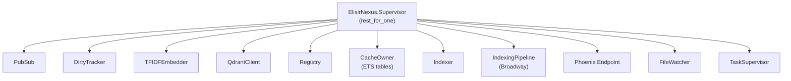

<p align="center">
  <picture>
    <source media="(prefers-color-scheme: dark)" srcset="code-nexus.svg" />
    <source media="(prefers-color-scheme: light)" srcset="docs/logo-dark.svg" />
    
  </picture>
</p>

<h1 align="center">CodeNexus</h1>

<p align="center">Code intelligence MCP server — graph-powered semantic search, call graph traversal, and impact analysis for any codebase.</p>

Built on Elixir/OTP with Ollama for dense embeddings, Qdrant for hybrid vector + keyword search (RRF fusion), and Sourceror/Tree-sitter for polyglot AST parsing. Designed for large codebases with live incremental indexing.


## Quick Start

**Prerequisites:** [Docker](https://docs.docker.com/get-docker/) and [Ollama](https://ollama.com) running with the embedding model pulled:

```bash
ollama pull embeddinggemma:300m
```

Then start CodeNexus with access to your projects:

```bash
WORKSPACE=~/projects docker-compose up -d
```

`WORKSPACE` sets which host directory CodeNexus can read for indexing. It's mounted read-only at `/workspace` inside the container. MCP `reindex(path)` accepts host paths (e.g. `~/projects/my-app`) — they're automatically translated to container paths.

Projects scattered across multiple directories? Add up to two more mounts:

```bash
WORKSPACE=~/projects WORKSPACE_HOST=~/projects \
WORKSPACE_2=~/GolandProjects WORKSPACE_HOST_2=~/GolandProjects \
docker-compose up -d
```

Without `WORKSPACE`, only the CodeNexus repo itself (`/app`) is indexable.

This starts three services in a single BEAM instance:

| Service | Port | Purpose |
|---------|------|---------|
| Phoenix Dashboard | `localhost:4100` | Web UI for search, vectors, stats |
| MCP HTTP Server | `localhost:3002` | MCP tools for AI agents |
| Qdrant | `localhost:6333` | Vector database |

**Connect Claude Code** — add to your project's `.mcp.json`:

```json
{
  "mcpServers": {
    "code-nexus": {
      "type": "http",
      "url": "http://localhost:3002/mcp"
    }
  }
}
```

### Indexing

Once running, use the `reindex` MCP tool from Claude Code (or any MCP client) — it accepts a path to your project and is the recommended approach. Claude Code will call it automatically when you ask about code.

To exclude paths from indexing, add a `.nexusignore` file to your project root (gitignore-style globs). CodeNexus also respects `.gitignore` automatically. A default deny list covers `node_modules`, `dist`, `target`, `.venv`, `__pycache__`, `*.min.js`, `*.map`, and similar noise.

### CLI

A standalone `nexus` CLI is available for scripting and terminal use — no Elixir required.

**macOS (Apple Silicon)**
```bash
curl -L https://github.com/iksnerd/code-nexus/releases/latest/download/nexus_darwin_arm64.tar.gz | tar xz
sudo mv nexus /usr/local/bin/
```

**macOS (Intel)**
```bash
curl -L https://github.com/iksnerd/code-nexus/releases/latest/download/nexus_darwin_amd64.tar.gz | tar xz
sudo mv nexus /usr/local/bin/
```

**Linux (amd64)**
```bash
curl -L https://github.com/iksnerd/code-nexus/releases/latest/download/nexus_linux_amd64.tar.gz | tar xz
sudo mv nexus /usr/local/bin/
```

Or build from source (requires Go 1.21+):
```bash
cd cli && make build && sudo mv nexus /usr/local/bin/
```

```bash
nexus search "error handling in HTTP client"
nexus callers embed_and_store
nexus impact QdrantClient.hybrid_search
nexus dead-code --prefix /workspace/myproject/lib
nexus status
nexus reindex ~/projects/myapp
```

Run `nexus` with no arguments for an interactive command picker. All commands accept `--server` (default `http://localhost:3002`) or `NEXUS_URL` env var to point at a remote server.

### Local Development

For building and testing CodeNexus itself:

```bash
docker-compose up -d qdrant   # Qdrant only
mix deps.get
mix phx.server                # Phoenix dashboard on :4100
mix mcp                       # MCP stdio transport
mix mcp_http --port 3002      # MCP HTTP transport
```

## Architecture



### Search Pipeline



1. **Dense embedding** via Ollama (default `embeddinggemma:300m`, falls back to TF-IDF)
2. **Sparse keyword vector** via TF-IDF feature hashing
3. **Qdrant hybrid query** with prefetch + RRF fusion (server-side)
4. **Deduplication** by name + entity type
5. **Graph re-ranking** using relationship boost from call graph
6. **Filter & limit** (remove temp files, sort by score)

### Deployment



### Supervision Tree



Strategy: `rest_for_one` — if a dependency crashes, all processes started after it restart. This ensures the Indexer restarts when CacheOwner or QdrantClient crash.

## MCP Tools

Ten tools for AI agents (Claude Code, Claude Desktop, Cursor, etc.):

| Tool | Description |
|------|-------------|
| **search_code**(query, limit) | Hybrid semantic + keyword search, ranked by vector similarity and graph centrality |
| **find_all_callees**(entity_name, limit) | Find all functions called by a given function |
| **find_all_callers**(entity_name, limit) | Find all callers of a function — follows both call edges and import references |
| **analyze_impact**(entity_name, depth) | Transitive blast radius — walks callers-of-callers AND importers up to `depth` levels |
| **get_community_context**(file_path, limit) | Discover structurally coupled files via call-graph and import edges (bidirectional) |
| **get_graph_stats**() | Codebase overview: node counts, edge counts, entity types, languages, top connected, critical files (betweenness centrality) |
| **get_status**() | Server health: indexed project, Qdrant/Ollama status, file count, collections, workspace projects |
| **find_module_hierarchy**(entity_name) | Module parents (behaviours/uses) and children — supports file-path and substring matching for TS/React components |
| **find_dead_code**(path_prefix) | Find exported functions/methods with zero callers — proactively flag unused code |
| **reindex**(path) | Parse and index source files to build the search index and call graph |

### Transport

MCP is served over HTTP (Streamable HTTP at `/mcp`) via Docker. For local development, stdio (`mix mcp`) is also available.

## REST API

### Observability

| Method | Endpoint | Description |
|--------|----------|-------------|
| GET | `/metrics` | Prometheus metrics (text format 0.0.4) — search latency, indexing throughput, Qdrant ops, BEAM VM stats |

### Search & Discovery

| Method | Endpoint | Description |
|--------|----------|-------------|
| POST | `/api/search` | Hybrid semantic + keyword search |
| POST | `/api/callees` | Find callees of a function |
| POST | `/api/index` | Trigger indexing |

### Vector Management

| Method | Endpoint | Description |
|--------|----------|-------------|
| GET | `/api/vectors/info` | Collection metadata |
| GET | `/api/vectors/count` | Point count |
| POST | `/api/vectors/scroll` | Paginated point listing |
| GET | `/api/vectors/:id` | Get a single point |
| POST | `/api/vectors/delete` | Delete points by ID |
| POST | `/api/vectors/reset` | Reset the collection |

## Polyglot Support

Elixir files are parsed via Sourceror (richer metadata). Other languages use Tree-sitter via a Rustler NIF, with language-specific extractors:

| Language | Extension | Parser | Extractor |
|----------|-----------|--------|-----------|
| Elixir | `.ex`, `.exs` | Sourceror | RelationshipExtractor |
| JavaScript | `.js`, `.jsx` | Tree-sitter | JavaScriptExtractor |
| TypeScript | `.ts`, `.tsx` | Tree-sitter | JavaScriptExtractor |
| Python | `.py` | Tree-sitter | PythonExtractor |
| Go | `.go` | Tree-sitter | GoExtractor |
| Ruby | `.rb` | Tree-sitter | GenericExtractor |
| Rust | `.rs` | Tree-sitter | GenericExtractor |
| Java | `.java` | Tree-sitter | GenericExtractor |

**Extractor capabilities:**

| Feature | JS/TS | Python | Go | Generic |
|---------|-------|--------|----|---------|
| Functions/classes/methods | Y | Y | Y | Y |
| Import extraction | Y | Y | Y | Y |
| Export extraction | Y | - | - | - |
| Decorator extraction | - | Y | - | - |
| Call graph | Y | Y | Y | Y |
| Package-qualified calls | Y | - | Y | - |
| Receiver methods | - | - | Y | - |
| Struct/interface extraction | - | - | Y | - |
| Arrow function classification | Y | - | - | - |
| Barrel file resolution | Y | - | - | - |
| Visibility (Go uppercase convention) | - | - | Y | - |
| Visibility (_private convention) | - | Y | - | - |

Tree-sitter support requires the Rust toolchain. Without it, only Elixir files are indexed.

### Embedding Strategy

| Vector Type | Model | Purpose |
|-------------|-------|---------|
| Dense (768-dim) | `embeddinggemma:300m` via Ollama (override with `OLLAMA_MODEL`) | Semantic similarity |
| Sparse | TF-IDF feature hashing (ETS-backed IDF) | Keyword/exact match |
| Fusion | Qdrant RRF | Combines both server-side |

## Web Dashboard

Phoenix LiveView UI at `http://localhost:4100`:

- **Dashboard** — Indexing statistics, entity/edge counts, language distribution, top connected modules, MCP tool reference. Auto-syncs from Qdrant when MCP reindexes externally.
- **Search** — Interactive hybrid search with scored results, entity badges, code preview, call/is_a tags.
- **Graph** — Interactive D3.js force-directed graph showing code relationships. Three edge types (calls, imports, contains) with distinct visual styles. Hover to highlight connected nodes and see detailed metadata.
- **Vectors** — Browse, filter, inspect, and manage stored vectors.

### Search


### Graph Visualization


The graph renders up to 500 nodes sorted by connectivity. Hover any node to highlight its neighbors and see file path, line range, calls, and imports in the detail panel. Zoom, pan, and drag nodes to explore.

### Vectors


## Testing

```bash
mix test                        # All tests (~725)
mix test --trace                # Verbose output
mix test --include performance  # Performance benchmarks (32 tests)
mix test test/elixir_nexus/parsers/  # Parser tests
```

## Performance Benchmarks

Run with `mix test --include performance`:

| Operation | Latency | Scale |
|-----------|---------|-------|
| ETS insert 10K chunks | 4ms | |
| ETS search 10K chunks | 13ms | |
| ETS 100 concurrent searches (p99) | 53ms | 10K chunks |
| Graph rebuild | 458ms | 1K chunks |
| Ollama single embed | 29ms | 768-dim |
| TF-IDF single embed | 0.09ms | 768-dim (~456x faster) |
| Hybrid search e2e (p50) | 21ms | |
| analyze_impact | 3.5ms | 500 entities |
| get_community_context | 1.2ms | 500 entities |
| Index 20 files (Broadway) | 2.0s | |
| PubSub 100 subscribers | 0.17ms max | |

## Changelog

See [CHANGELOG.md](CHANGELOG.md) for the full version history.

## License

MIT
