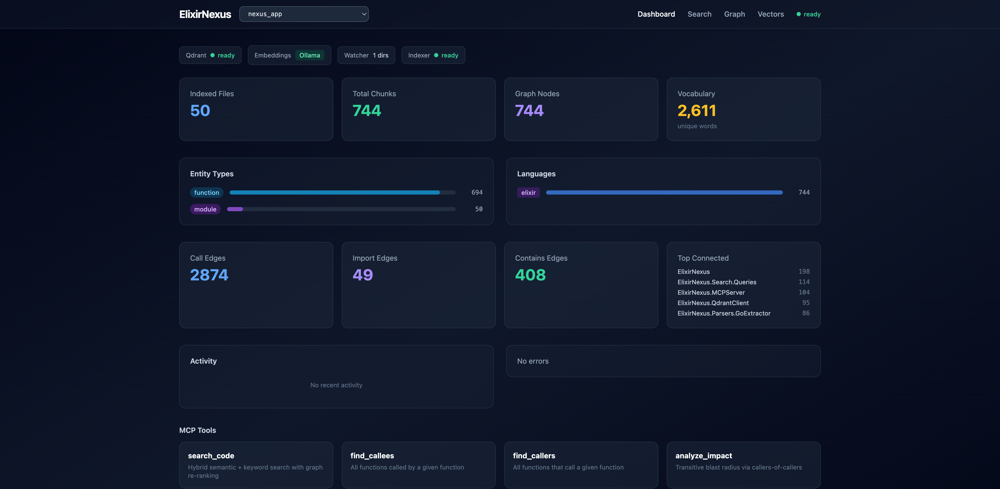
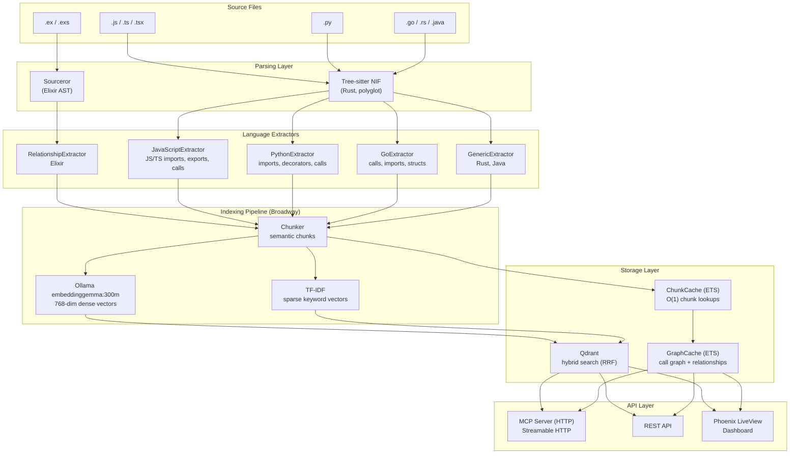
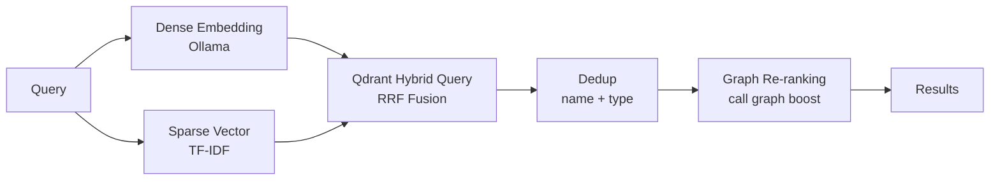
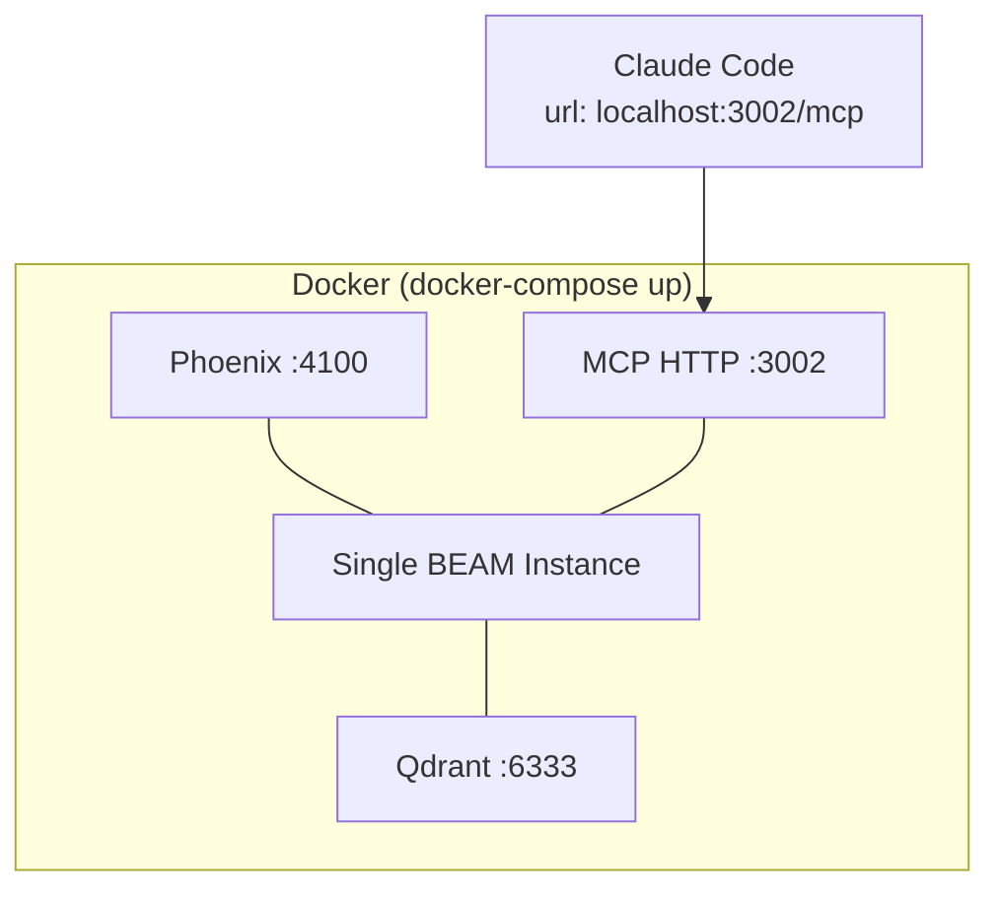
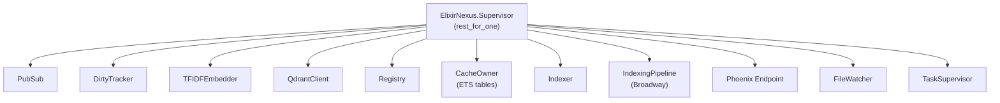
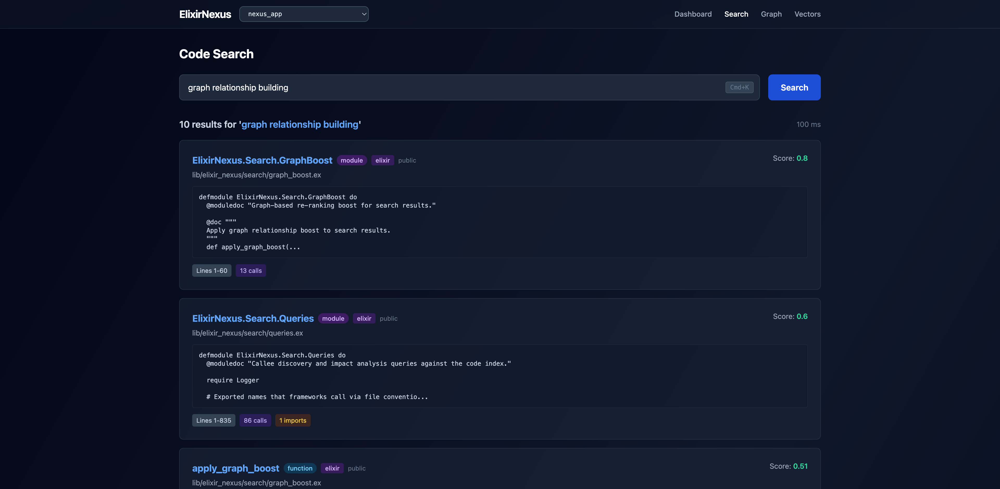
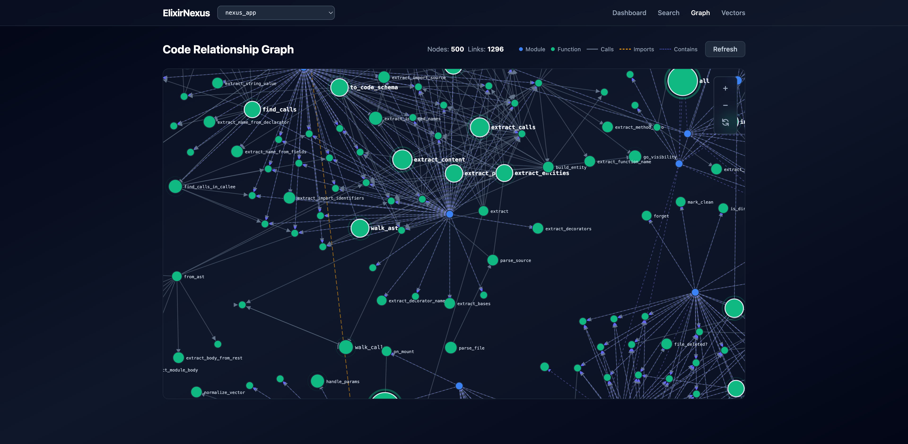
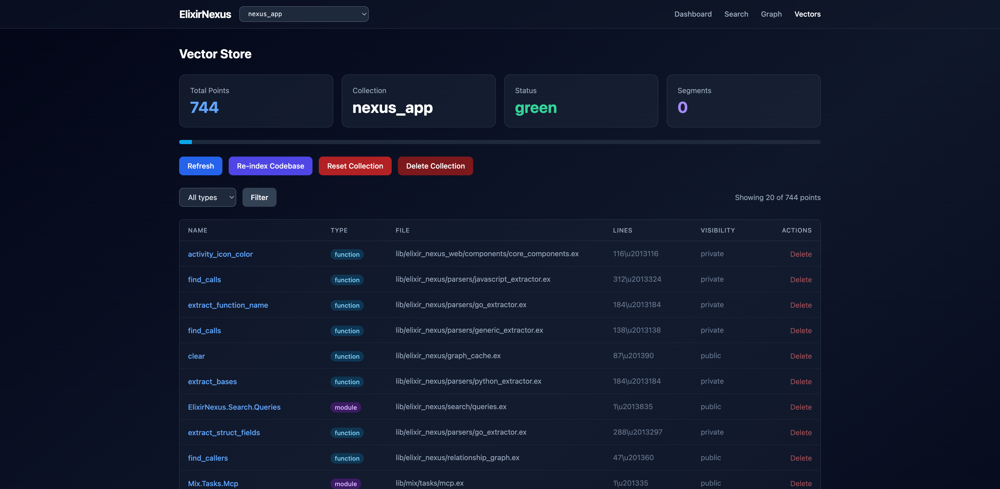

<p align="center">
  <picture>
    <source media="(prefers-color-scheme: dark)" srcset="code-nexus.svg" />
    <source media="(prefers-color-scheme: light)" srcset="docs/logo-dark.svg" />
    
  </picture>
</p>

<h1 align="center">CodeNexus</h1>

<p align="center">Code intelligence MCP server — graph-powered semantic search, call graph traversal, and impact analysis for any codebase.</p>

Built on Elixir/OTP with Ollama for dense embeddings, Qdrant for hybrid vector + keyword search (RRF fusion), and Sourceror/Tree-sitter for polyglot AST parsing. Designed for large codebases with live incremental indexing.



## Quick Start

**Prerequisites:** [Docker](https://docs.docker.com/get-docker/) and [Ollama](https://ollama.com) running with the embedding model pulled:

```bash
ollama pull embeddinggemma:300m
```

Then start CodeNexus with access to your projects:

```bash
WORKSPACE=~/projects docker-compose up -d
```

`WORKSPACE` sets which host directory CodeNexus can read for indexing. It's mounted read-only at `/workspace` inside the container. MCP `reindex(path)` accepts host paths (e.g. `~/projects/my-app`) — they're automatically translated to container paths.

Projects scattered across multiple directories? Add up to two more mounts:

```bash
WORKSPACE=~/projects WORKSPACE_HOST=~/projects \
WORKSPACE_2=~/GolandProjects WORKSPACE_HOST_2=~/GolandProjects \
docker-compose up -d
```

Without `WORKSPACE`, only the CodeNexus repo itself (`/app`) is indexable.

This starts three services in a single BEAM instance:

| Service | Port | Purpose |
|---------|------|---------|
| Phoenix Dashboard | `localhost:4100` | Web UI for search, vectors, stats |
| MCP HTTP Server | `localhost:3002` | MCP tools for AI agents |
| Qdrant | `localhost:6333` | Vector database |

**Connect Claude Code** — add to your project's `.mcp.json`:

```json
{
  "mcpServers": {
    "code-nexus": {
      "type": "http",
      "url": "http://localhost:3002/mcp"
    }
  }
}
```

### Indexing

Once running, use the `reindex` MCP tool from Claude Code (or any MCP client) — it accepts a path to your project and is the recommended approach. Claude Code will call it automatically when you ask about code.

For local dev, a CLI is also available:

```bash
mix index /path/to/code
mix index /path/to/file.ex
mix index --status
```

### Local Development

For building and testing CodeNexus itself:

```bash
docker-compose up -d qdrant   # Qdrant only
mix deps.get
mix phx.server                # Phoenix dashboard on :4100
mix mcp                       # MCP stdio transport
mix mcp_http --port 3002      # MCP HTTP transport
```

## Architecture



### Search Pipeline



1. **Dense embedding** via Ollama (default `embeddinggemma:300m`, falls back to TF-IDF)
2. **Sparse keyword vector** via TF-IDF feature hashing
3. **Qdrant hybrid query** with prefetch + RRF fusion (server-side)
4. **Deduplication** by name + entity type
5. **Graph re-ranking** using relationship boost from call graph
6. **Filter & limit** (remove temp files, sort by score)

### Deployment



### Supervision Tree



Strategy: `rest_for_one` — if a dependency crashes, all processes started after it restart. This ensures the Indexer restarts when CacheOwner or QdrantClient crash.

## MCP Tools

Nine tools for AI agents (Claude Code, Claude Desktop, Cursor, etc.):

| Tool | Description |
|------|-------------|
| **search_code**(query, limit) | Hybrid semantic + keyword search, ranked by vector similarity and graph centrality |
| **find_all_callees**(entity_name, limit) | Find all functions called by a given function |
| **find_all_callers**(entity_name, limit) | Find all callers of a function — follows both call edges and import references |
| **analyze_impact**(entity_name, depth) | Transitive blast radius — walks callers-of-callers AND importers up to `depth` levels |
| **get_community_context**(file_path, limit) | Discover structurally coupled files via call-graph and import edges (bidirectional) |
| **get_graph_stats**() | Codebase overview: node counts, edge counts, entity types, languages, top connected, critical files (betweenness centrality) |
| **find_module_hierarchy**(entity_name) | Module parents (behaviours/uses) and children — supports file-path and substring matching for TS/React components |
| **find_dead_code**(path_prefix) | Find exported functions/methods with zero callers — proactively flag unused code |
| **reindex**(path) | Parse and index source files to build the search index and call graph |

### Transport

MCP is served over HTTP (Streamable HTTP at `/mcp`) via Docker. For local development, stdio (`mix mcp`) is also available.

## REST API

### Search & Discovery

| Method | Endpoint | Description |
|--------|----------|-------------|
| POST | `/api/search` | Hybrid semantic + keyword search |
| POST | `/api/callees` | Find callees of a function |
| POST | `/api/index` | Trigger indexing |

### Vector Management

| Method | Endpoint | Description |
|--------|----------|-------------|
| GET | `/api/vectors/info` | Collection metadata |
| GET | `/api/vectors/count` | Point count |
| POST | `/api/vectors/scroll` | Paginated point listing |
| GET | `/api/vectors/:id` | Get a single point |
| POST | `/api/vectors/delete` | Delete points by ID |
| POST | `/api/vectors/reset` | Reset the collection |

## Polyglot Support

Elixir files are parsed via Sourceror (richer metadata). Other languages use Tree-sitter via a Rustler NIF, with language-specific extractors:

| Language | Extension | Parser | Extractor |
|----------|-----------|--------|-----------|
| Elixir | `.ex`, `.exs` | Sourceror | RelationshipExtractor |
| JavaScript | `.js`, `.jsx` | Tree-sitter | JavaScriptExtractor |
| TypeScript | `.ts`, `.tsx` | Tree-sitter | JavaScriptExtractor |
| Python | `.py` | Tree-sitter | PythonExtractor |
| Go | `.go` | Tree-sitter | GoExtractor |
| Ruby | `.rb` | Tree-sitter | GenericExtractor |
| Rust | `.rs` | Tree-sitter | GenericExtractor |
| Java | `.java` | Tree-sitter | GenericExtractor |

**Extractor capabilities:**

| Feature | JS/TS | Python | Go | Generic |
|---------|-------|--------|----|---------|
| Functions/classes/methods | Y | Y | Y | Y |
| Import extraction | Y | Y | Y | Y |
| Export extraction | Y | - | - | - |
| Decorator extraction | - | Y | - | - |
| Call graph | Y | Y | Y | Y |
| Package-qualified calls | Y | - | Y | - |
| Receiver methods | - | - | Y | - |
| Struct/interface extraction | - | - | Y | - |
| Arrow function classification | Y | - | - | - |
| Barrel file resolution | Y | - | - | - |
| Visibility (Go uppercase convention) | - | - | Y | - |
| Visibility (_private convention) | - | Y | - | - |

Tree-sitter support requires the Rust toolchain. Without it, only Elixir files are indexed.

### Embedding Strategy

| Vector Type | Model | Purpose |
|-------------|-------|---------|
| Dense (768-dim) | `embeddinggemma:300m` via Ollama (override with `OLLAMA_MODEL`) | Semantic similarity |
| Sparse | TF-IDF feature hashing (ETS-backed IDF) | Keyword/exact match |
| Fusion | Qdrant RRF | Combines both server-side |

## Web Dashboard

Phoenix LiveView UI at `http://localhost:4100`:

- **Dashboard** — Indexing statistics, entity/edge counts, language distribution, top connected modules, MCP tool reference. Auto-syncs from Qdrant when MCP reindexes externally.
- **Search** — Interactive hybrid search with scored results, entity badges, code preview, call/is_a tags.
- **Graph** — Interactive D3.js force-directed graph showing code relationships. Three edge types (calls, imports, contains) with distinct visual styles. Hover to highlight connected nodes and see detailed metadata.
- **Vectors** — Browse, filter, inspect, and manage stored vectors.

### Search



### Graph Visualization



The graph renders up to 500 nodes sorted by connectivity. Hover any node to highlight its neighbors and see file path, line range, calls, and imports in the detail panel. Zoom, pan, and drag nodes to explore.

### Vectors



## Testing

```bash
mix test                        # All tests (~725)
mix test --trace                # Verbose output
mix test --include performance  # Performance benchmarks (32 tests)
mix test test/elixir_nexus/parsers/  # Parser tests
```

## Performance Benchmarks

Run with `mix test --include performance`:

| Operation | Latency | Scale |
|-----------|---------|-------|
| ETS insert 10K chunks | 4ms | |
| ETS search 10K chunks | 13ms | |
| ETS 100 concurrent searches (p99) | 53ms | 10K chunks |
| Graph rebuild | 458ms | 1K chunks |
| Ollama single embed | 29ms | 768-dim |
| TF-IDF single embed | 0.09ms | 768-dim (~456x faster) |
| Hybrid search e2e (p50) | 21ms | |
| analyze_impact | 3.5ms | 500 entities |
| get_community_context | 1.2ms | 500 entities |
| Index 20 files (Broadway) | 2.0s | |
| PubSub 100 subscribers | 0.17ms max | |

## Changelog

### v1.3.5
- **OSS prep** — untrack Rust build artifacts (`native/tree_sitter_nif/target/`), set `MIX_ENV: prod` in docker-compose, fix broken `.claude/skills` symlink (relative path survives clone on any machine)
- **Docs** — README prerequisites, fix indexing section, port, test count; DOCKERHUB.md tags current; remove stale `quickstart.sh` and orphaned `.mmd` files
- **CI fix** — test collection race condition: `QdrantClient.init/1` now creates the default collection synchronously in test env using `Mix.env() == :test` (prior `Application.get_env` check was always `nil` because `config/test.exs` is not imported by `config/config.exs`)

### v1.3.4
- **Fix: skills wiped at runtime by dev-mode code reload** — v1.3.3 baked skills correctly into the builder's `.beam` files, but the runtime stage didn't include `.agents/`. Phoenix's `code_reloader: true` (dev mode in docker-compose.yml) recompiled `MCPServer.Resources` at boot, found `@skills_dir` empty, and overwrote the well-formed `.beam` with an empty `@skill_content`. Fix: also copy `.agents/` into the runtime stage so dev-mode recompile sees the source. Production-mode (no code reloader) wouldn't have this problem, but matching the running config is safer than counting on it.

### v1.3.3
- **Fix: `.dockerignore` was hiding SKILL.md from the build context** — v1.3.2 added `COPY .agents .agents` to the Dockerfile but `.dockerignore` had `*.md` (with only `!mix.exs` exception), so Docker never put any markdown into the build context. Compile-time skill enumeration ran on a directory without SKILL.md files. Add `!.agents/**/*.md` exception so bundled skills actually get embedded.

### v1.3.2
- **Fix: Docker image missing bundled skills** — `.agents/` was not copied into the builder stage, so the v1.3.0/v1.3.1 published images compiled `Resources.skill_index/0` with an empty directory and shipped zero skills. Added `COPY .agents .agents` before `mix compile`. The skill content is baked into the module binary at compile time, so the runtime stage is unchanged.

### v1.3.1
- **Restrict MCP-exposed skills to user-facing client guides** — only `nexus-client-*` skills are exposed as `nexus://skill/<name>` resources. Internal-development skills (Elixir/OTP/Phoenix patterns, code-nexus internals) stay in `.agents/skills/` for repo contributors but aren't surfaced over the wire. Three new client skills shipped:
  - `nexus-client-search-recipes` — query patterns for `search_code`, when grep wins, intent-based phrasing
  - `nexus-client-refactoring-workflow` — `analyze_impact` → `find_all_callers` recipe and `depth` parameter guide
  - `nexus-client-onboarding` — first-look workflow for unfamiliar codebases, the right tool order

### v1.3.0
- **Skills exposed as MCP resources** — every bundled skill in `.agents/skills/` is now reachable as `nexus://skill/<name>`, with a `nexus://skills/index` listing all of them. Resources are enumerated and embedded at compile time (`@external_resource` triggers a recompile when any `SKILL.md` changes), so the running container needs no filesystem access to serve them.
- **`load_resources` tool fallback for clients without resource support** — the existing tool now also lists skills in its no-arg response, so MCP clients that only speak tools (not resources) can still discover and read skills via `load_resources(uri: "nexus://skill/<name>")`.

### v1.2.9
- **Image catch-up release** — rolls up v1.2.8 (test env short-circuit, slim CI triggers), the `vectors_controller` scroll 404 handler, and the `mcp_server_query_tools` flake fix (defensive `Map.get` for optional chunk fields, `on_exit` cache cleanup). No runtime behavior change for non-test code paths; just brings the published image version stamp in sync with main.

### v1.2.8
- **Skip real Ollama calls in tests** — `EmbeddingModel.embed_batch/1` short-circuits to `{:error, :test_mode}` when `config :elixir_nexus, env: :test`. Tests that called `Indexer.index_file/1` were previously timing out on `econnrefused` to localhost:11434 in CI (no Ollama service). Existing TF-IDF fallback path handles the error gracefully. CI test runtime drops from ~10min back to ~30s.
- **Slim CI triggers** — `.github/workflows/ci.yml` no longer runs on tag pushes (releases are local via Makefile). PR + main push still run tests; secret scan stays scheduled weekly.

### v1.2.7
- **Add Go convention dirs to source detection** — `cmd/`, `internal/`, `pkg/` are now in `@indexable_dirs`. Without this, monorepos like council-hub had `mcp-server/cmd/` skipped during depth-2 detection, even though the Go files inside it should be indexed. `find_project_root/1` source-dir list also gets the additions so paths like `/workspace4/mcp-server/cmd` correctly strip to the parent module.

### v1.2.6
- **Disambiguate sub-project collection names** — when a project is reindexed from a subdirectory of a single-project workspace mount (e.g. `/workspace4/mcp-server` under `WORKSPACE_HOST_4=/Users/yourname/council-hub`), the collection name now prefixes the parent mount's host basename: `nexus_council_hub__mcp_server` instead of the ambiguous `nexus_mcp_server`. Multi-project mounts (`WORKSPACE_HOST=/Users/yourname/projects`) and root-mount reindexes are unaffected.

### v1.2.5
- **Monorepo source-dir detection** — `IndexingHelpers.detect_indexable_dirs/1` now descends one level when no top-level source dir is found. Repos like `council-hub` (with `channel-plugin/src`, `mcp-server/cmd`, `ui/lib` at depth 2) now index all subprojects in a single `reindex(...)` call instead of just the root files. Single-project repos still take the fast top-level path.

### v1.2.4
- **No auto-create of default collection at boot** — `QdrantClient.init/1` no longer schedules `:ensure_collection`. Previously this produced a duplicate `nexus_app` collection alongside the explicitly-indexed `nexus_<project>` for the same code (the in-container `/app` is the same source as host-mounted `~/www/elixir-nexus`). The default collection is now created on first explicit `reindex(...)`. Searches against a non-existent collection still fall back to the indexer keyword search (existing 404 handling), so this is a quieter-state change, not a breaking one.

### v1.2.3
- **Fix collection name for single-project mounts** — when `WORKSPACE_HOST_N` points at the project root itself (v1.2.2), the resolved container path is `/workspaceN`, which previously produced a useless `nexus_workspaceN` collection name. `IndexManagement.ensure_collection_for_project/2` now accepts the user's `display_path` and prefers the bare project name (e.g. `nexus_council_hub` instead of `nexus_workspace4`).
- **Trim trailing underscores in collection names** — prevents `nexus_` / `nexus__` artifacts when the source path ends in `.` or `_`.

### v1.2.2
- **Single-project workspace mounts** — when `WORKSPACE_HOST_N` points at the project root itself (rather than a parent directory of projects), `reindex(<project-name>)` now resolves bare names to the mount itself. Useful for repos like `~/council-hub` that aren't grouped under a parent. The `available projects` list also includes these mounts (detected via top-level source dirs or project markers like `README.md`, `Dockerfile`, `mix.exs`, `package.json`, etc.).

### v1.2.1
- **Workspace mounts extended to 5 slots** — `WORKSPACE_4`/`WORKSPACE_5` (with matching `WORKSPACE_HOST_4`/`WORKSPACE_HOST_5`) now mount additional host directories at `/workspace4`/`/workspace5`. Useful when projects are scattered across `~/GolandProjects`, `~/WebstormProjects`, `~/PyCharmProjects`, etc.
- **Better busy reindex error message** — instead of `Reindex failed: :indexing_in_progress`, the response now names the project currently being reindexed and explains why concurrent reindex of different projects is rejected.
- **Quieter boot logs** — the expected 409 "Collection already exists" response on startup is now logged at debug, not warning.

### v1.2.0
- **Default embedding model is now `embeddinggemma:300m`** — `embedding_model.ex` `@default_model`, `docker-compose.yml`, `.env.example`, `config/config.exs` all updated. `OLLAMA_MODEL=nomic-embed-text` continues to work as an override.
- **Fix concurrency race in collection switch** — `reindex` now pre-checks `Indexer.busy?/0` before calling `ensure_collection_for_project`, so a rejected reindex no longer swaps the active Qdrant collection out from under in-flight Broadway batches (which previously caused hundreds of `404 Not found: Collection 'nexus_X' doesn't exist` errors).
- **Fix cold-start Ollama timeouts dropping chunks** — `embed_batch/1` now retries on `:timeout`/`:connect_timeout`/`:econnrefused` (up to 3 attempts, linear backoff); `recv_timeout` raised from 30s → 60s; `EmbeddingModel.warm_up/0` runs at supervisor start so the first real batch doesn't block on a cold model load.
- **Fix Docker healthcheck** — `code_nexus` healthcheck now uses `bash /dev/tcp` (the published image has no `curl`), so the container is correctly marked healthy.

### v1.1.0
- **Multi-workspace Docker mounts** — `WORKSPACE_2`/`WORKSPACE_3` env vars mount additional host directories at `/workspace2`/`/workspace3`. Bare project names in `reindex` are resolved across all active mounts, so projects scattered across different host directories are all accessible without a shared parent.
- 725 tests total

### v1.0.5
- **Fix Qdrant test collection leak** — cleanup in 3 MCP server reindex tests moved to `on_exit` so it runs even on test failure; deleted 19 previously accumulated orphan collections
- **Test splits** — `mcp_server_test.exs`, `relationship_graph_test.exs`, `indexer_test.exs` split into 8 focused files, completing the test reorganisation series
- **`qdrant_client.ex` internal reorganisation** — sections reordered into clear domains: configuration, GenServer lifecycle, collection management, search (read-only), point reads, point writes, callbacks, HTTP helpers
- **QdrantClient tests** — 20 new tests covering `collection_name/0` derivation logic, `active_collection/0` Application env reads, process dict override, and `switch_collection_force/1`; collection management functions now have coverage
- 725 tests total

### v1.0.4
- **Fix dashboard broken LiveView** — vendor JS files (`phoenix.min.js`, `phoenix_live_view.min.js`) were not tracked in git, so Docker builds excluded them. All LiveView interactivity (buttons, graph, search) was broken in Docker mode.
- **Static asset tests** — new `static_assets_test.exs` verifies vendor JS and image files are served with 200
- **Graph page tests** — new `graph_live_test.exs` covers mount, refresh, collection switch, and event handling
- **Test collection cleanup** — `ExUnit.after_suite` now deletes the test Qdrant collection after each test run
- 707 tests total

### v1.0.3
- Rename container name `elixir_nexus` → `code_nexus` in docker-compose and Makefile

### v1.0.2
- **Fix `load_resources` entity types showing as `"unknown"`** — `nexus://project/overview`, `nexus://project/architecture`, and `nexus://project/hotspots` now correctly read `node["entity_type"] || node["type"]`, matching the key used by `RelationshipGraph.build_graph/1`
- **13 new tests for `MCPServer.Resources`** — overview, architecture, hotspots, and not-indexed message paths now directly covered

### v1.0.1
- **Internal refactor** — split 4 large source files (`search/queries.ex`, `mcp_server.ex`, `javascript_extractor.ex`, `go_extractor.ex`) into focused domain sub-modules; all public APIs unchanged
- **Test reorganisation** — 5 large test files split into 23 focused test files, matching source module boundaries
- **Direct unit tests for `EntityResolution` and `PathResolution`** — `matches_entity_name?/2`, `import_matches_file?/2`, `find_entity_multi_strategy/2`, and `PathResolution` pure functions now have dedicated test coverage
- 714 tests total, 0 failures

### v1.0.0
- **Server renamed to `code-nexus`** — MCP server name updated for discoverability by JS/TS/Go/Python users
- **`"use client"` / `"use server"` directive indexing** — Next.js directives tagged as `directive:use-client` / `directive:use-server` metadata on file-level entities; improves search precision on full-stack codebases
- **tsconfig path alias resolution** — `find_module_hierarchy` now reads `tsconfig.json` `compilerOptions.paths` to resolve `@/*` → `src/*` style aliases accurately
- **`OLLAMA_MODEL` env var** — embedding model is now configurable via `OLLAMA_MODEL` (default: `nomic-embed-text`)
- **Reindex default-path warning** — when no `path` is given in local/no-workspace mode and no project has been indexed yet, result includes a `warning` key
- **Extended graph noise filter** — `get_graph_stats` top-connected now filters short PascalCase wrapper names (`Comp`, `Box`, `Row`, etc.) and common React utility names (`createContext`, `memo`, `Fragment`, etc.)
- **GitHub topics** — `mcp`, `code-intelligence`, `elixir`, `tree-sitter`, `qdrant`, `semantic-search`
- **3 new project-switching tests** — nonexistent collection, rapid successive switches, switch-while-idle

### v0.9.0
- **MCP Resources** — expose codebase knowledge as MCP resources (`nexus://guide/tools`, `nexus://project/overview`, `nexus://project/architecture`, `nexus://project/hotspots`) for resource-aware clients
- **`load_resources` fallback tool** — list or read resources from clients that only support tools (follows MCP creator's recommended pattern)
- Dynamic resources generated from ETS caches (ChunkCache, GraphCache) — no Qdrant calls needed

### v0.8.0
- **Concurrent QdrantClient reads** — cross-project isolation, process dictionary collection pinning
- **Caller refinement** — callers now resolve to enclosing function, not module
- **Fuzzy callees** — short name matching for `find_all_callees`
- **`@/` path alias resolution** — JS/TS `@/components/...` imports resolved to actual entities
- **Reindex warning** — omitting `path` when workspace projects exist now returns an error instead of silently indexing `/app`

### v0.7.1
- **Qdrant test collection cleanup** — deleted 84 orphaned test collections, added `QdrantClient.delete_collection/1` by name, fixed test cleanup to prevent future accumulation

### v0.7.0
- **Broadway error handling** — parse failures now properly use `Broadway.Message.failed/2` instead of silently swallowing errors
- **TFIDFEmbedder ETS crash-safe** — IDF table moved to CacheOwner (survives TFIDFEmbedder crashes)
- **Deduplicated indexing handlers** — extracted `prepare_reindex/1` and `do_index_files/3`
- **`is_dirty?/1` → `dirty?/1`** — renamed to follow Elixir naming convention
- **Single source of truth for extensions** — `DirtyTracker` now delegates to `IndexingHelpers.all_indexable_extensions/0`
- **`search_chunks/2` optimization** — removed GenServer bottleneck, calls ETS directly
- **ChunkCache.search performance** — replaced O(n) `length/1` with O(1) counter accumulator in foldl
- **Node structure consistency** — `update_file/2` now uses `"entity_type"` matching `rebuild_from_chunks/1`
- **15 Agent Skills** — `.agents/skills/` with 10 general Elixir/OTP/Phoenix skills + 5 project-specific skills (agentskills.io standard)
- 640 tests (7 new)

### v0.6.0
- **CI fixed** — NIF and file watcher tests now correctly excluded in CI; version assertion no longer hardcoded
- **`find_all_callers` line numbers** — `start_line`/`end_line` now populated with real function positions (was always 0)
- **`get_graph_stats` includes `project_path`** — survives MCP server restarts so callers can detect stale index
- **Docker image 588MB** (was 3.28GB) — multi-stage build drops Rust toolchain from runtime; added `.dockerignore`
- 12 new tests (633 total)

### v0.5.0
- D3 force-directed graph at `/graph` — 3 edge types, hover highlighting, glow rings, 500-node cap
- README overhaul with fresh benchmarks and dashboard screenshots

### v0.4.0
- JSX component renders tracked as call edges in `find_all_callees`
- `find_dead_code` filters framework conventions (Next.js pages, layouts, route handlers, loading)
- Framework utility noise (`cn`, `Comp`, `Slot`) filtered from `get_graph_stats` top-connected
- `serverInfo.version` now reads from `mix.exs`

### v0.3.0
- `file_path` no longer null in `find_all_callers` results
- `critical_files` betweenness centrality working for all graph sizes
- Dead code convention filter for JS/TS (GET, POST, generateStaticParams, etc.)

### v0.2.0
- CI/CD, Makefile, Docker Hub publishing
- Streamable HTTP transport (replaces SSE)
- Ollama embeddings (replaces Bumblebee/EXLA)
- Go language support, dead code detection, import graph tracking

## License

MIT
