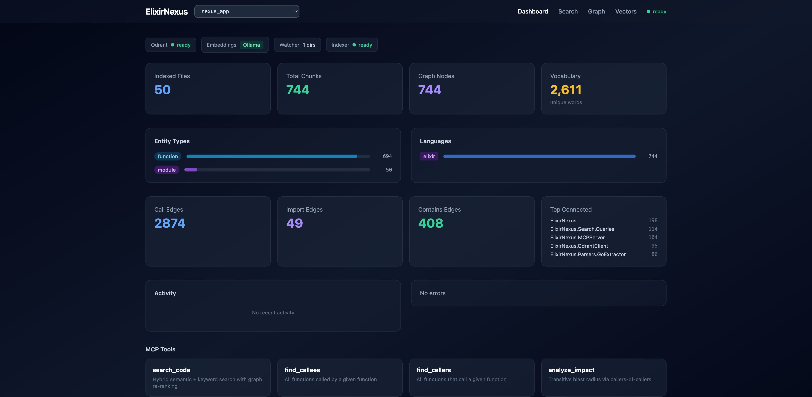
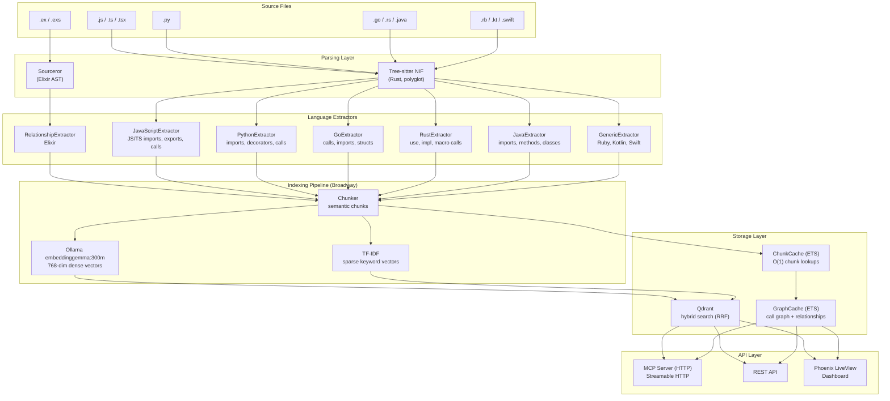
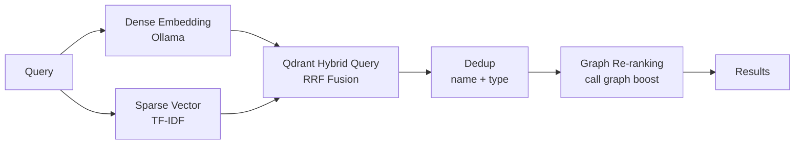
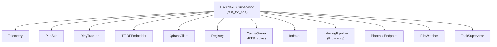
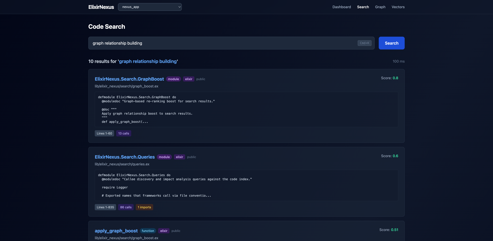
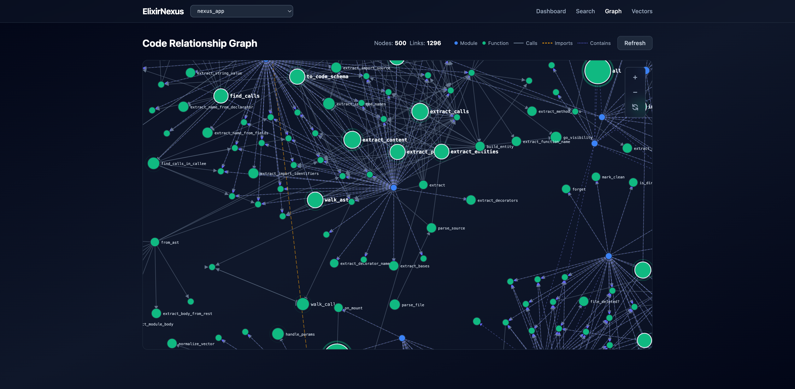
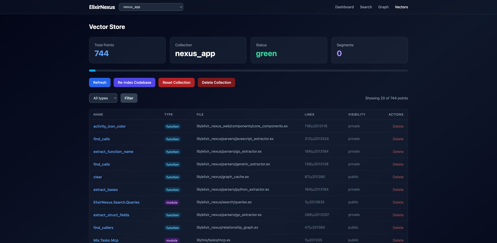

<p align="center">
  <picture>
    <source media="(prefers-color-scheme: dark)" srcset="code-nexus.svg" />
    <source media="(prefers-color-scheme: light)" srcset="docs/logo-dark.svg" />
    
  </picture>
</p>

<h1 align="center">CodeNexus</h1>

<p align="center">An MCP server that gives AI agents semantic search, call graphs, and impact analysis over your codebase.</p>

Grep finds strings. An agent refactoring code needs to know who calls a function, what a change breaks two hops out, and where the code for "retry logic in the HTTP client" lives when nothing is named `retry`. CodeNexus parses your project into a call graph, embeds each function, and serves both over MCP to Claude Code, Cursor, or any other MCP client.

It runs on Elixir/OTP. Ollama produces the dense embeddings, Qdrant does hybrid vector + keyword search with RRF fusion, and Sourceror plus Tree-sitter parse ten languages. Indexing is incremental: only changed files are re-parsed, and a file watcher keeps the index current while you edit.



## Quick Start

You need [Docker](https://docs.docker.com/get-docker/) and [Ollama](https://ollama.com) with the embedding model pulled:

```bash
ollama pull embeddinggemma:300m
```

No Ollama? Set `EMBEDDING_BACKEND=tfidf` to use local TF-IDF embeddings instead. Indexing is faster; semantic matches are weaker.

Start CodeNexus with read access to your projects:

```bash
WORKSPACE=~/projects WORKSPACE_HOST=~/projects docker-compose up -d
```

`WORKSPACE` is mounted read-only at `/workspace` in the container. `WORKSPACE_HOST` tells the server which host path that is, so `reindex` accepts host paths like `~/projects/my-app` and translates them. Without `WORKSPACE`, only the CodeNexus repo itself (`/app`) is indexable.

Projects spread across several directories? Add up to four more mounts, each with its own `WORKSPACE_HOST_N`:

```bash
WORKSPACE=~/projects WORKSPACE_HOST=~/projects \
WORKSPACE_2=~/GolandProjects WORKSPACE_HOST_2=~/GolandProjects \
docker-compose up -d
```

This starts two containers:

| Container | Port | Purpose |
|-----------|------|---------|
| `code_nexus` | `localhost:4100` | Phoenix dashboard (search, graph, vectors, stats) |
| `code_nexus` | `localhost:3002` | MCP server (Streamable HTTP at `/mcp`) |
| `qdrant` | `localhost:6333` | Vector database |

The dashboard and the MCP server run in the same BEAM, so they share caches and live updates.

Check that everything came up:

```bash
curl -s localhost:4100/health
```

It returns JSON with the status of MCP, Qdrant, and Ollama, and responds with HTTP 503 if any of them is down. An unreachable Ollama is the usual culprit; the container expects it at `host.docker.internal:11434`.

**Connect Claude Code** by adding this to your project's `.mcp.json`:

```json
{
  "mcpServers": {
    "code-nexus": {
      "type": "http",
      "url": "http://localhost:3002/mcp"
    }
  }
}
```

### Indexing

Nothing is searchable until a project is indexed. Call the `reindex` MCP tool with your project; Claude Code usually does this on its own when you ask about code. The first index of a large project takes a while, since every chunk goes through Ollama. After that, only changed files are re-parsed. The path can be:

- a bare project name, like `my-app`, found in any mounted workspace
- a host path, like `~/projects/my-app`
- a container path, like `/workspace/my-app`

If a bare name exists in more than one mount, the directory that is a real project (has a manifest, a `.git`, or source dirs) wins over an empty one. If it's a real project in several mounts, `reindex` asks for the full path.

To exclude paths, add a `.nexusignore` file (gitignore-style globs) to the project root. `.gitignore` is respected too, and a built-in deny list already skips `node_modules`, `dist`, `target`, `.venv`, `__pycache__`, `*.min.js`, `*.map`, and similar.

### Project configuration (`.nexus.toml`)

CodeNexus infers each file's architectural layer from directory names (`ports`, `adapters`/`infrastructure`, `services`, `repositories`, `core`/`entities`, presentation) and reports the breakdown in `get_graph_stats`. No config is required.

An optional `.nexus.toml` at the project root covers what the conventions can't guess. Both sections are optional:

```toml
# Files reachable only through the framework or dependency injection: route
# handlers, sitemaps, wired adapters. Their exports are excluded from find_dead_code.
[entry_points]
include = ["app/**/route.ts", "app/sitemap.ts", "app/manifest.ts"]

# Override layer classification when directory names don't follow the convention.
[layers]
ports = "core/ports/**"
adapters = "infrastructure/**"
```

Globs are gitignore-style: `**` spans directories, `*` matches within one path segment.

### CLI

The `nexus` CLI talks to a running server from the terminal or scripts. It's a standalone binary, so it doesn't need Elixir installed. Pick your platform:

```bash
# macOS Apple Silicon: nexus_darwin_arm64   macOS Intel: nexus_darwin_amd64
# Linux x86-64:        nexus_linux_amd64    Linux ARM:   nexus_linux_arm64
curl -L https://github.com/iksnerd/code-nexus/releases/latest/download/nexus_darwin_arm64.tar.gz | tar xz
sudo mv nexus /usr/local/bin/
```

Or build from source (Go 1.26+): `cd cli && make build && sudo mv nexus /usr/local/bin/`

```bash
nexus search "error handling in HTTP client"
nexus callers embed_and_store
nexus impact QdrantClient.hybrid_search
nexus dead-code --prefix /workspace/myproject/lib
nexus status
nexus reindex ~/projects/myapp
```

Run `nexus` with no arguments for an interactive command picker. Every command takes `--server` (default `http://localhost:3002`) or reads `NEXUS_URL`. More in [cli/README.md](cli/README.md).

## MCP Tools

Twelve tools, usable from Claude Code, Claude Desktop, Cursor, or any MCP client:

| Tool | Description |
|------|-------------|
| **search_code**(query, limit) | Hybrid semantic + keyword search, ranked by vector similarity and graph centrality |
| **find_all_callees**(entity_name, limit) | Functions called by a given function |
| **find_all_callers**(entity_name, limit) | Callers of a function, following both call edges and import references |
| **analyze_impact**(entity_name, depth) | Transitive blast radius: callers of callers and importers, up to `depth` levels |
| **get_community_context**(file_path, limit) | Files structurally coupled to this one through call and import edges, in both directions |
| **get_graph_stats**() | Node and edge counts, entity types, languages, top connected entities, architectural layers, and critical files (deterministic betweenness centrality) |
| **get_status**() | Indexed project, Qdrant and Ollama health, file count, collections, workspace projects |
| **find_module_hierarchy**(entity_name) | Parents (uses/implements), children (contained members), and implementors. Works for Elixir modules, Go/Rust/Java types, and TS classes, interfaces, and type aliases |
| **find_dead_code**(path_prefix) | Exported functions and methods with zero callers. Honors `.nexus.toml` entry points and framework conventions |
| **reindex**(path) | Parse and index a project to build the search index and call graph |
| **purge**() | Wipe the current collection and caches for a clean re-index |
| **load_resources**(uri) | List or read MCP resources, for clients without native resource support |

MCP is served over Streamable HTTP at `/mcp`. For local development, stdio (`mix mcp`) works too.

## How it works


```mermaid
graph TB
    subgraph Sources["Source Files"]
        EX[".ex / .exs"]
        JS[".js / .ts / .tsx"]
        PY[".py"]
        GORS[".go / .rs / .java"]
        OTHER[".rb / .kt / .swift"]
    end

    subgraph Parsing["Parsing Layer"]
        SR["Sourceror<br/>(Elixir AST)"]
        TS["Tree-sitter NIF<br/>(Rust, polyglot)"]
    end

    subgraph Extractors["Language Extractors"]
        RE["RelationshipExtractor<br/>Elixir"]
        JSE["JavaScriptExtractor<br/>JS/TS imports, exports, calls"]
        PYE["PythonExtractor<br/>imports, decorators, calls"]
        GOE["GoExtractor<br/>calls, imports, structs"]
        RUE["RustExtractor<br/>use, impl, macro calls"]
        JAE["JavaExtractor<br/>imports, methods, classes"]
        GE["GenericExtractor<br/>Ruby, Kotlin, Swift"]
    end

    subgraph Indexing["Indexing Pipeline (Broadway)"]
        CH["Chunker<br/>semantic chunks"]
        OL["Ollama embeddinggemma:300m<br/>768-dim dense vectors"]
        TFIDF["TF-IDF<br/>sparse keyword vectors"]
    end

    subgraph Storage["Storage Layer"]
        QD["Qdrant<br/>hybrid search (RRF)"]
        CC["ChunkCache (ETS)<br/>O(1) chunk lookups"]
        GC["GraphCache (ETS)<br/>call graph + relationships"]
    end

    subgraph API["API Layer"]
        MCP_HTTP["MCP Server (HTTP)<br/>Streamable HTTP"]
        REST["REST API"]
        PHX["Phoenix LiveView<br/>Dashboard"]
    end

    EX --> SR --> RE
    JS --> TS --> JSE
    PY --> TS --> PYE
    GORS --> TS --> GOE & RUE & JAE
    OTHER --> TS --> GE

    RE & JSE & PYE & GOE & RUE & JAE & GE --> CH
    CH --> OL & TFIDF
    OL & TFIDF --> QD
    CH --> CC --> GC

    QD & GC --> MCP_HTTP & REST & PHX
```

Each file is parsed into entities (functions, modules, classes, interfaces) with their calls, imports, and contained members. Entities become chunks, and each chunk gets two vectors: a 768-dim dense embedding from Ollama (`embeddinggemma:300m` by default, override with `OLLAMA_MODEL`) and a sparse TF-IDF keyword vector. Qdrant stores both. The call graph is cached in ETS, so graph queries normally run in memory.

### Search pipeline


```mermaid
graph LR
    Q["Query"] --> DE["Dense Embedding<br/>Ollama"]
    Q --> SE["Sparse Vector<br/>TF-IDF"]
    DE & SE --> HQ["Qdrant Hybrid Query<br/>RRF Fusion"]
    HQ --> DD["Dedup<br/>name + type"]
    DD --> GR["Graph Re-ranking<br/>call graph boost"]
    GR --> R["Results"]
```

1. Dense embedding via Ollama (falls back to TF-IDF if Ollama is unavailable)
2. Sparse keyword vector via TF-IDF feature hashing
3. Qdrant hybrid query with prefetch and server-side RRF fusion
4. Deduplication by name and entity type
5. Re-ranking with a boost from the call graph
6. Filtering (temp files dropped), sorting, and limit

### Supervision tree


```mermaid
graph TD
    SUP["ElixirNexus.Supervisor<br/>(rest_for_one)"]
    SUP --> TEL["Telemetry"]
    SUP --> PS["PubSub"]
    SUP --> DT["DirtyTracker"]
    SUP --> TF["TFIDFEmbedder"]
    SUP --> QC["QdrantClient"]
    SUP --> REG["Registry"]
    SUP --> CO["CacheOwner<br/>(ETS tables)"]
    SUP --> IDX["Indexer"]
    SUP --> IP["IndexingPipeline<br/>(Broadway)"]
    SUP --> EP["Phoenix Endpoint"]
    SUP --> FW["FileWatcher"]
    SUP --> TS["TaskSupervisor"]
```

The supervisor uses `rest_for_one`: when a process crashes, everything started after it restarts too. So if CacheOwner or QdrantClient crashes, the Indexer restarts with it.

## Web Dashboard

The Phoenix LiveView UI at `http://localhost:4100` has four pages:

- **Dashboard**: indexing stats, entity and edge counts, language distribution, architecture-layer breakdown, top connected modules. Picks up reindexes triggered over MCP automatically.
- **Search**: hybrid search with scores, entity badges, code preview, and call/import tags.
- **Graph**: a D3 force-directed graph of calls, imports, and containment, clustered into package boxes. Capped at the 500 most-connected nodes, with filters and layout sliders.
- **Vectors**: browse, filter, inspect, and delete stored vectors.







## Local development

For working on CodeNexus itself:

```bash
docker-compose up -d qdrant   # Qdrant only
mix deps.get
mix phx.server                # Phoenix dashboard on :4100
mix mcp                       # MCP stdio transport
mix mcp_http --port 3002      # MCP HTTP transport
```

Run the tests with `mix test` (add `--include performance` for the benchmarks). The tests expect Qdrant on `localhost:6333`. `CLAUDE.md` covers the NIF build, the fast local iteration loop, and the pre-push checks.

## Documentation

- [docs/languages.md](docs/languages.md): supported languages and the per-extractor capability matrix
- [docs/rest-api.md](docs/rest-api.md): REST, health, and Prometheus metrics endpoints
- [docs/benchmarks.md](docs/benchmarks.md): performance benchmark results
- [docs/ui.md](docs/ui.md): dashboard architecture and cross-BEAM sync
- [docs/DOCKERHUB.md](docs/DOCKERHUB.md): Docker image usage, including `docker run` without compose and every environment variable
- [cli/README.md](cli/README.md): the `nexus` CLI
- [CONTRIBUTING.md](CONTRIBUTING.md) and [SECURITY.md](SECURITY.md)

## Changelog

See [CHANGELOG.md](CHANGELOG.md) for the full version history.

## License

MIT
